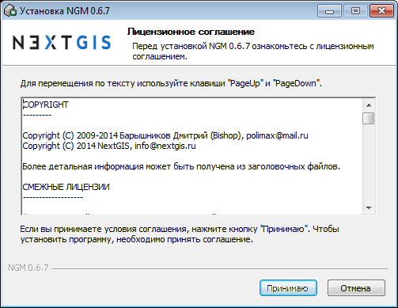
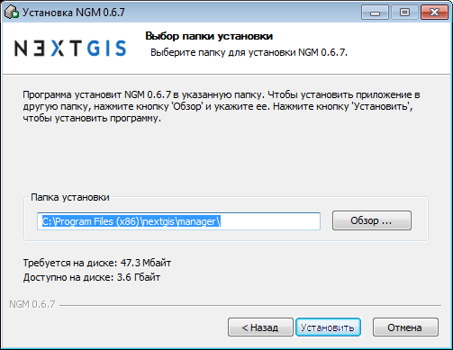
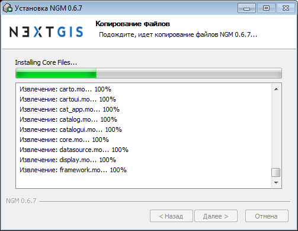
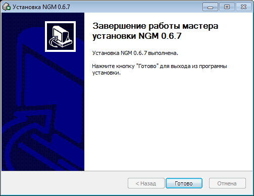

.. sectionauthor:: Артём Светлов <artem.svetlov@nextgis.ru>

.. _ng_manager_install:

Установка
==========

Последняя версия установщика под ОС :program:`Microsoft Windows` может быть скачана по следующему адресу:

http://nextgis.ru/nextgis-manager/.

Установщик представляет собой пошаговый мастер. На первой странице мастера (см. :numref:`ngmInstallPage01`) необходимо прочитать и принять лицензионное соглашение.

   Первая страница мастера установки

На второй странице (см. рис. :numref:`ngmInstallPage02`) необходимо указать путь до папки установки.

   Вторая страница мастера установки

На третей странице мастера (см. :numref:`ngmInstallPage03`) начнётся процесс установки файлов.

   Третяя страница мастера установки

На четвёртой странице (см. рис. :numref:`ngmInstallPage04`) выведется сообщение о завершении установки.

   Четвёртая страница мастера установки

