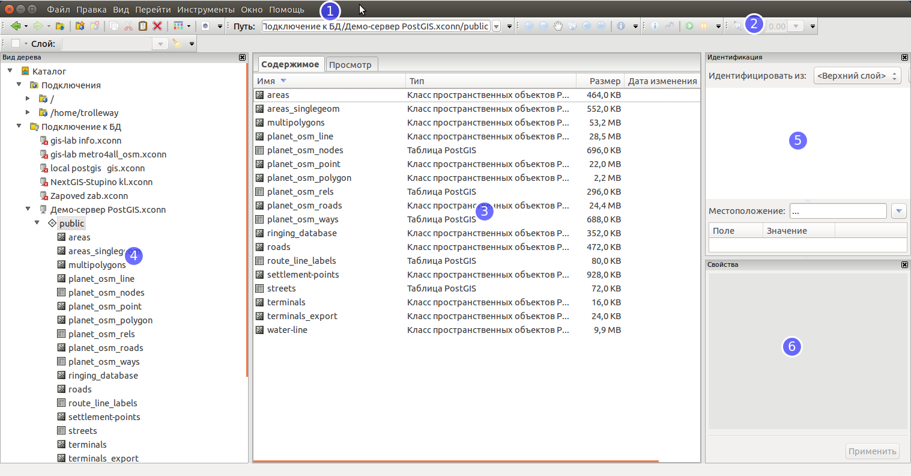

.. sectionauthor:: Артём Светлов <artem.svetlov@nextgis.ru>

.. _ng_manager_intro:

Введение
========

В настоящем документе представлено руководство пользователя :program:`NextGIS Manager` версии |version|. 
В руководстве даны общие сведения о программном обеспечении (ПО), описание пользовательского 
интерфейса, рассмотрены базовые пользовательские задачи.

.. only:: latex

   Данная документация распространяется по лицензии Creative Commons 
   **"Attribution-NoDerivs" ("Атрибуция — Без производных произведений") СC BY-ND**
   
   .. image:: _static/cc_by.png 

Описание програмы
-------------------

Приложение :program:`NextGIS Manager` предназначено для 

* Быстрого просмотра файлов с геоданными в векторных и растровых форматах. Пользователь 
  может быстро оценить содержимое файлов, не дождаясь их длительного открытия в более 
  "тяжелых" ГИС-програмах.
* Просмотра метаданных файлов с геоданными.
* Функционала файлового менеджера для файлов с геоданными: копирование, переименование 
  и перенос по файловой системе с учётом формата данных. Например, при переносе шейпфайла 
  переносятся все входящие в него файлы. 
* Работы внутри ZIP-архивов. 
* Конвертации между форматами.

Такие же операции реализованы для баз данных PostGIS.

* Импорт и экспорт геоданных из файлов в PostGIS и обратно.

Интерграция с веб-гис NextGIS Web. 

* Загрузка векторных данных из файлов в NextGIS Web
* Загрузка растровых файлов в NextGIS Web с автоматической обрезкой (добавлением альфа-канала)
* Манипуляция ресурсами NextGIS Web. Программа дублирует большинство операций 
  веб-интерфейса NextGIS Web, что позволяет ускорить рутинные операции администратора 
  по работе с веб-гис.

Интерфейс
---------

Основное окно программы (см. :numref:`ngm_gui_mainscren`) представляет собой аналог 
проводника в Windows или файлового менеджера Nautilus в Ubuntu.

   Основное окно программы

   1 - строка меню, 2 - панель инструментов, 3 - рабочая область, 4 - дерево элементов каталога, 5 - окно идентификации, 6 - окно свойств
