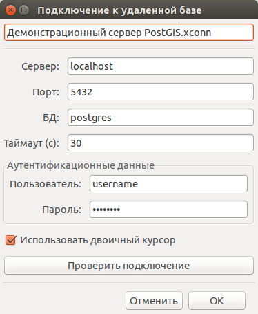
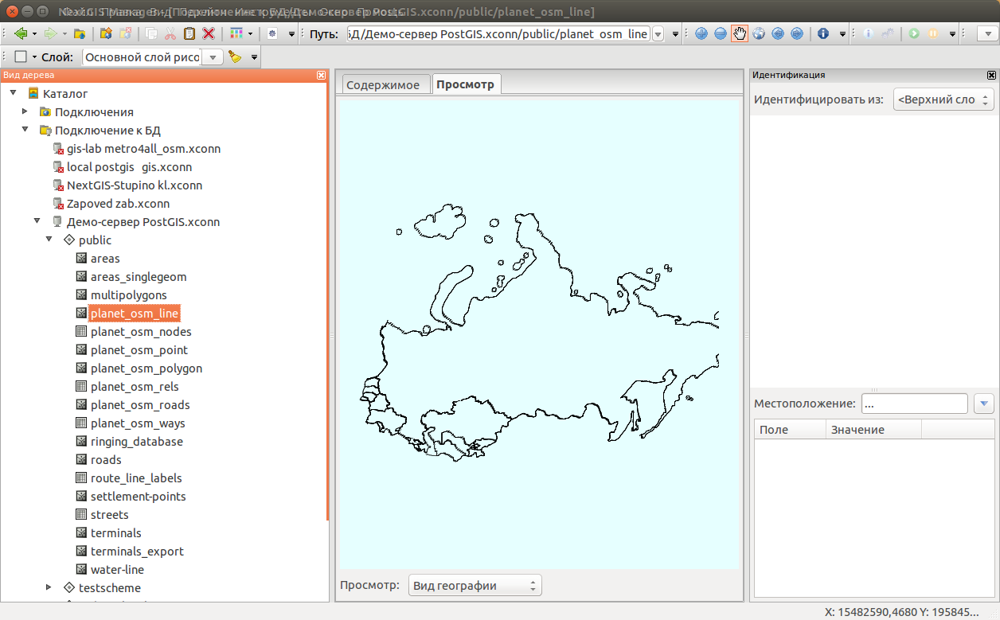

.. sectionauthor:: Артём Светлов <artem.svetlov@nextgis.ru>

.. _ngm_user_tasks:

Процесс работы
======================================

Работа с файлами
---------------------------------------

Постоянное подключение к папке
^^^^^^^^^^^^^^^^^^^^^^^^^^^^^^^^^

В дереве элементов каталога вы видите меню "Подключения". В нём находится корневой 
каталог вашей файловой системы (для Linux) или список жестких дисков (для Windows). 
Вы можете добавить в него подключение к часто используемой папке, например к вашему 
рабочему проекту. Откройте в дереве элементов каталога нужную папку, выделите её, 
и в контекстном меню нажмите :guilabel:`Создать связь с текущей папкой`. 

Просмотр файлов с геоданными
^^^^^^^^^^^^^^^^^^^^^^^^^^^^^^^^^

* Выберите в дереве элементов каталога папку с файлами геоданных.
* Выберите в дереве элементов каталога файл с геоданными. Выберите вкладку 
  :guilabel:`Просмотр`.
  
  * Если в списке режимов просмотра задан :guilabel:`Вид географии`, то в рабочей 
    области нарисуются границы геометрии. 
  * Если в списке режимов просмотра задан :guilabel:`Вид таблицы`, то в рабочей 
    области выведется таблица атрибутов. 

Отрисовка устроена так, чтобы она занимала наименьшее время, поэтому в отличие от 
полноценных ГИС, тут нельзя открывать несколько слоёв одновременно или настраивать оформление. 
Имеются следующие возможности:

* Поворот.
* Идентификация объектов в векторном слое.
* Просмотр свойств растрового слоя (выделите его в виде дерева, и выберите в 
  контекстном меню :guilabel:`Свойства`.

.. note:: 
   Работа с не-RGB растрами происходит так же, как и с обычными, но их отображение 
   не реализовано.

Список поддерживаемых форматов приведён в разделе :ref:`ngm_formats`.

Просмотр метаданных файла
^^^^^^^^^^^^^^^^^^^^^^^^^^^^^^^^^

Запускается через :menuselection:`Контекстное меню элемента каталога --> Свойства`. 

Операции с файлами
^^^^^^^^^^^^^^^^^^^^^^^^^^^^^^^^^

**Перенос файлов**

Переносить файлы можно несколькими способами: 

* **drag and drop внутри дерева**, **drag and drop из рабочей области в режиме 
  просмотра каталога - в дерево** . Файлы можно переносить drag and drop-ом 
  внутри дерева элементов каталога. С нажатой клавишей Shift файл перенесётся, 
  если клавишу не нажимать, то скопируется. 
* **Копирование-вставка через контекстное меню**. Файлы можно копировать, вырезать
  и вставлять через контекстные меню.

**Переименование файлов**

:menuselection:`Контекстное меню элемента каталога --> Переименовать`. При переименовывании 
шейпфайла переименовываются все входящие в него отдельные файлы.

Конвертация файлов
^^^^^^^^^^^^^^^^^^^^^^^^^^^^^^^^^

**Простое сохранение слоя данных**

Выберите :menuselection:`Контекстное меню элемента каталога --> Экспорт`. 

**Сохранение слоя данных с параметрами**

Выберите :menuselection:`Контекстное меню элемента каталога --> Экспорт с параметрами`. 

Список поддерживаемых форматов приведён в разделе :ref:`ngm_formats`.

**Экспорт атрибутов**

Запускается через :menuselection:`Контекстное меню файла --> Экспорт атрибутов`.
Можно сохранить атрибуты векторного файла в отдельный файл. 
Список поддерживаемых форматов приведён в разделе :ref:`ngm_formats`.

Отправка на e-mail
^^^^^^^^^^^^^^^^^^^^^^^^^^^^^^^^^

Запускается через :menuselection:`Контекстное меню элемента каталога --> Отправить по почте`. 
Для этого на компьютере должна быть настроена почтовая программа.

.. note:: 
   Такие же операции можно выполнять и с файлами в ZIP-архивах, однако это может 
   занять длительное время. 

Работа с PostGIS
---------------------------------------

ПО позволяет работать с базами данных PostGIS так же, как с файлами. 

Для начала работы нужно создать подключение. Выберите в дереве элементов каталога
пункт :guilabel:`Подключение к БД`, затем щёлкните :menuselection:`Контекстное меню элемента каталога --> Создать --> Подключение к БД`. 
В поле :guilabel:`Название` введите любое название. Остальные поля заполните имеющимися
у вас параметрами доступа. По нажатии кнопки :guilabel:`Проверить подключение` 
выведется сообщение - есть ли доступ к базе с введёными вами параметрами или нет. 
После ввода в дереве элементов каталога добавится подключение к заданной базе данных. 

При открытии этого подключения внутри будут видны схемы базы данных, а внутри схем - таблицы. 
Таблицы с полем геометрии будут отображаться так же, как слои геоданных - у них будет
рисоваться геометрия, будет работать идентификация. Работа с ними осуществляется так же,
как с файлами геоданных. 

Создание схем БД
^^^^^^^^^^^^^^^^^

**Создание схем БД**  запускается через :menuselection:`Контекстное меню 
подключения к базе данных --> Создать --> Схема БД`.

Импорт геоданных из файловой системы в БД
^^^^^^^^^^^^^^^^^^^^^^^^^^^^^^^^^^^^^^^^^^^^^^^^^^^

**Перетаскивание**

Слои геоданных можно перетаскивать по дереву элементов каталога из подключения к
папке в схему базы данных.

**Через диалог сохранения**

Выберите :menuselection:`Контекстное меню элемента каталога --> Экспорт с параметрами`. 
Укажите формат :guilabel:`Класс пространственных объектов PostGIS` и выберите в пути 
для сохранения базу данных.

Экспорт геоданных из БД в файловую систему
^^^^^^^^^^^^^^^^^^^^^^^^^^^^^^^^^^^^^^^^^^^^^^^^^^^

При переносе данных из БД в файловую систему нужно обязательно выбрать формат, в который 
эти данные будут сохранены, поэтому **Перетаскивание** в этой операции не работает.

**Через диалог сохранения**

Выберите :menuselection:`Контекстное меню элемента каталога --> Экспорт с параметрами`.

Работа с NextGIS Web
---------------------------------------

ПО позволяет работать с инстансом веб-гис :program:`NextGIS Web`. Ресурсами NGW 
можно манипулировать так же, как файлами. 
Это позволяет выполнять рутинные операции быстрее, чем в браузере.

.. comments Я не пойму, почему тут не работает масштаб

.. list-table::
    :widths: 20 80 
    :header-rows: 0

    * - **Создание подключения к NextGIS Web** 
      
      - Для начала работы нужно создать подключение. Выберите в дереве элементов 
        каталога пункт :guilabel:`Подключения к веб-сервисам`, затем щёлкните 
        :menuselection:`Контекстное меню элемента каталога --> Создать --> 
        Подключение к NGW`. После ввода всех параметров в дереве элементов каталога 
        добавится подключение к заданному инстансу. Введите в первое поле любое название 
        подключения. В поле :guilabel:`URL` - адрес из адресной строки NGW, до слова 
        "/resource".

        .. image:: _static/ngw_create_connection.png
           :width: 11cm

        Проверьте подключение соответствующей кнопкой. При настройках NGW по умолчанию, 
        если пароль подключения будет введён неправильно, соединение установится, 
        но на правах "Неавторизованного пользователя".

        .. image:: _static/ngw_create_connection_window.png
           :width: 6cm

    * - **Создание групп ресурсов**
      
      - Группы ресурсов в NGW создаются так же, как папки в файловой системе.
        
        .. image:: _static/ngw_create_resourse_group.png
	       :width: 12cm

    * - **Перенос ресурсов между группами**
           
      - Действие выполняется аналогично переносу файлов между папками в файловой системе. 
        
        .. image:: _static/ngw_resourse_cut.png
	       :width: 11cm

    * - **Загрузка векторных геоданных из файловой системы в NGW**
           
      - Выберите в дереве элементов каталога группу ресурсов. Затем, :menuselection:`Контекстное меню элемента каталога --> Импорт`.
        
        .. image:: _static/ngw_import_vector_menu.png
	       :width: 11cm
      
        Укажите в открывшемся диалоге векторный файл.  
        После загрузки слоя автоматически создастся векторный стиль по умолчанию.
        
        .. image:: _static/ngw_import_vector_configure.png
	       :width: 16cm
      
        При успешном открытии файла откроется диалог, в котором по нажатию кнопки 
        :guilabel:`Тест` следует проверить правильность отображения русских символов.
        В отличие от веб-интерфейса можно импортировать не только Shapefile, но и 
        другие векторные форматы.
        
        .. image:: _static/ngw_import_vector_test.png
           :width: 14cm

    * - **Добавление векторных слоёв из подключения к БД в NGW**
           
      - Если в NGW есть настроенное и работающее подключение к базе данных PostGIS, 
        то в дереве элементов каталога это подключение будет видно как ресурс. Его 
        можно открыть, и в нём будут видны слои БД. Их можно перетаскивать в группы 
        ресурсов NGW.
        
        .. image:: _static/ngw_import_postgis.png
	       :width: 9cm

    * - **Загрузка растров из файловой системы в NGW**
           
      - Выберите в дереве элементов каталога группу ресурсов. Затем, 
        :menuselection:`Контекстное меню элемента каталога --> Импорт`. Укажите в 
        открывшемся диалоге растровый файл.
         
        .. image:: _static/ngw_import_raster.png
	       :width: 10cm

        Откроется окно настроек. В нём можно указать комбинацию каналов для 
        многоканального растра. 

        .. image:: _static/ngw_import_raster_settings.png
	       :width: 16cm

        По нажатию кнопки :guilabel:`Автоматическая обрезка` при загрузке будут 
        детектированы и отрезаны пустые области на краю растра. Эта функция полезна 
        при загрузке космоснимков в NGW.

        .. image:: _static/ngw_two_rasters.png
	       :width: 16cm

